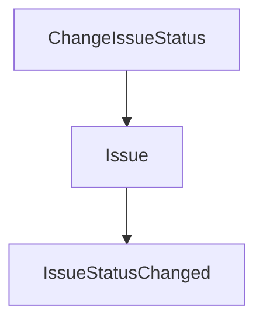

# Graphify Knowledge Map Skill

Use this skill when the user asks for a graph, knowledge map, dependency map, relation map, architecture map, or compressed structural overview.

This skill is for compact structural representation. It does not guarantee a fixed token reduction ratio.

## Inputs

- Topic, feature, subsystem, or decision.
- Known entities/concepts/components.
- Relationships, dependencies, or flows.
- Desired graph format, if provided.

## Workflow

1. Identify the main nodes.
2. Classify nodes by type: actor, feature, aggregate, command, event, service, adapter, storage, queue, cache, index, policy, test, risk.
3. Identify directed edges.
4. Label each edge with the relationship type.
5. Remove duplicate or low-value nodes.
6. Prefer stable architecture relationships over incidental implementation details.
7. Mark source-of-truth boundaries clearly.
8. Add risks only when they affect the graph.
9. Keep the graph compact.

## Output formats

### Compact edge list

Preferred for token economy:

```text
NodeA --relationship--> NodeB
NodeB --emits--> EventC
EventC --handled_by--> HandlerD
```

### Typed node list

Use when node types matter:

```text
[Aggregate] Issue
[Command] ChangeIssueStatus
[Policy] IssueTransitionPolicy
[Event] IssueStatusChanged
```

### Mermaid graph

Use only when the user asks for visualizable output:



## Boardly relationship labels

Use consistent labels:

```text
owns
uses
calls
validates
authorizes
persists
emits
publishes
handles
indexes
caches
invalidates
reads_from
writes_to
source_of_truth
projects_to
depends_on
risks
```

## Boardly rules

- Relational DB must be marked as source of truth when persistence is involved.
- Redis must be marked as cache/fast storage only.
- OpenSearch/Elasticsearch must be marked as search/read-side only.
- RabbitMQ/Messenger must be marked as async side-effect transport only.
- Do not imply Redis, OpenSearch, or RabbitMQ own core state.
- Do not replace a needed architecture explanation with a graph unless the user asked for compact graph output.

## Common mistakes

- Creating too many nodes.
- Using vague edges like `related_to` everywhere.
- Mixing domain facts with infrastructure details without labels.
- Treating graph output as proof of correctness.
- Claiming exact token reduction ratios.
